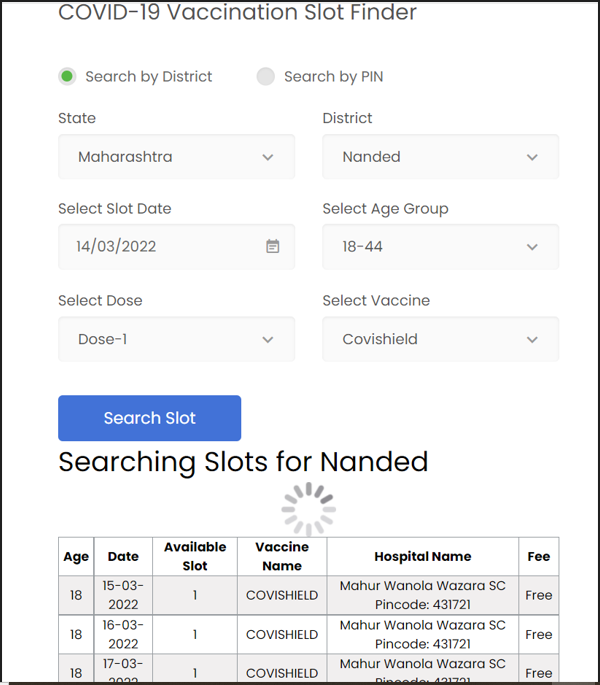

**Project Name: Trace It** 

**Project Abstract:** 

TraceIt is designed to help Sunita (elderly people above 65+ ) to detect lungs-related diseases(pulmonary) using chest x-rays, to check for availability of beds (ICU beds, Ventilator, Oxygen Beds, Normal Beds) and vaccines in the nearest hospital in a fraction of seconds. TraceIt, a web app is a multi-utility one for many destinations to solve a few of the major concerns which helps elderly people to live a healthier and better life. I aim to ease the hassle seen around the world due to an increase in lungs related diseases and other such major concerns i.e. availability of beds in hospitals and vaccine slots locators. Thus, using this website most of these concerns are addressed and are solved to the maximum potential.

**What problem does it solve?:**  Due to all complications and confusions being faced by people above 65+ I have tried to solve the problems of detection of lungs related diseases and also provide two more amenities. Since these are the major concerns for the age 65+, by addressing these issues I expect this will lower some amount of hassle that is seen everywhere around the world.

**Technology Stack:**

**Approach of Development:**

**I have developed  the web app “Trace iT” using 4 modules:**

**1. Lungs-Related Disease Detector:**

The detector will be using Machine learning with predefined datasets of 219 COVID-19 chest X-Rays,1341 images of Normal Chest X-Rays and 1345 images of viral Pneumonia. Using this datasets, I will perform training on images using Convolutional Neural Network (CNN). User will upload his/her chest X-Ray and the system will predict lungs related diseases and display it to the user.

**2. Hospital Bed Availability Locator (ICU beds, Ventilator, Oxygen Beds, Normal Beds):**

In this module, I will be using open-source API using which I will let users locate Beds in their region, city, locality, hospitals, etc.

**3. Vaccine Locator:**

In this module, I will be using open-source API using which user will be able to know where they can find hospitals having the vaccine drive.

**Running the application :**

1. Install the flask application on you device.
1. In command prompt, navigate to the project folder using the cd command.
1. Set the FLASK\_APP environment.
   1. For linux:
      1. Export FLASK\_APP=hello.py.
   1. For windows:
      1. Setx FLASK\_APP “hello.py”.
1. Run the flask app with:
   1. Flask run.
   1. This results a confirmation message and address.
1. By pasting this address into the browser the project will start running.

**Use Case Diagram/Flow Diagram:**

**Screenshots :**

Homepage...

Lung disease detector : 

Result :

Vaccine slot finder :

Bed locator : 

